# GPT2-SFT


项目参考：

[GitHub - rasbt/LLMs-from-scratch: Implement a ChatGPT-like LLM in PyTorch from scratch, step by step](https://github.com/rasbt/LLMs-from-scratch)

Transformer构建：[GitHub - JY-Ou/build\_a\_transformer: 从零搭建原始Transformer](https://github.com/JY-Ou/build_a_transformer)

模型使用`gpt2-medium (355M)`，加载 open-ai 预训练好的模型

模型下载运行`utils/download.py`，指令微调运行`train_instruct`，DPO运行`train—dpo`

评估模型训练效果`eval.py`，暴力搜超参`search_hparam.py`
## 数据处理

数据分析：
`data/instruction-data.json`下包含
1. 数学计算：加法、面积计算、平方根等
2. 分类/归类问题：动物分类、物品分类、正负面情感分类等
3. 知识问答类：科学知识、单位转换、定义解释等
4. 语言处理类：重写句子、词形变化、排序等

<p >
    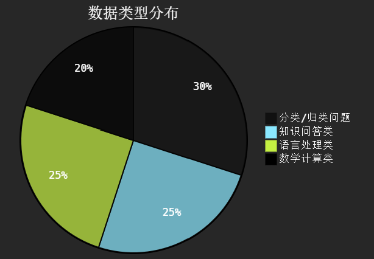
<p>

垃圾邮件分类任务：
`utils/downloadpy`下载分类文本数据
<p >
    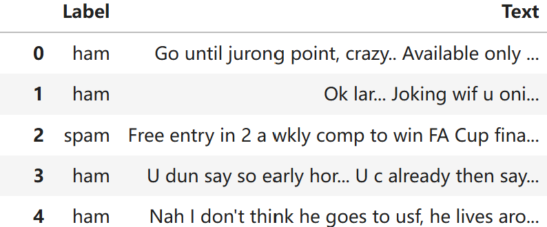
<p>

原始数据正负样本不平衡，运行`data/text_data_process.py`处理数据并切分数据集

### 指令微调数据
指令微调格式有两种格式
- [the Alpaca](https://crfm.stanford.edu/2023/03/13/alpaca.html)
- [Phi-3](https://arxiv.org/abs/2404.14219)

使用`Alpaca`格式

```
{'instruction': 'Identify the correct spelling of the following word.', 'input': 'Ocassion', 'output': "The correct spelling is 'Occasion.'"}
{'instruction': "What is an antonym of 'complicated'?", 'input': '', 'output': "An antonym of 'complicated' is 'simple'."}
```

- 填充Padding使同一batch下的样本同一长度（但不同batch可以具有不同的长度）
- 使用 `<|endoftext|>` 为padding token，训练时使用`ignore_index`(-100)替换padding token，使其在训练时不计算padding损失
（文本末尾的`<|endoftext|>`不替换，告诉LLM这是句尾）
- 由于没有类似llama2使用特殊token如`[INST]`，这里直接使用`###instruct`，`###intput`，`###response`为特殊标记使用，在微调后设计chat模版抽离出`###response`即可
- sft训练是为了使模型学习到`###instruct... /n/n###input.../n/n###response...`这种模式，在对话时构建chat模版提取出`###response`内容即可

扩展：Llama训练
- LLAMA2-chat中user标识 是 `[INST]` ， assistant 标识是`[/INST]`，模型只能接受非结构化数据，利用chat模版转换输入如：`[INST]`今天天气怎样`[/INST]`今天天气很好
- sft时input_ids对应模型输入，labels则是为了和模型输出计算loss，则只需在每轮对话头尾使用`[BOS]`和`[EOS]`


```
chat_temp = [
                {"role": "user", "content": Q1},
                {"role": "assistant", "content": A1},
                {"role": "user", "content": Q2},
                {"role": "assistant", "content": A2},
            ]

[BOS][INST]Q1[\INST]A1[EOS][BOS][INST]Q2[\INST]A2[EOS]
```
模型是由上一个输入预测下一个输出，则label为

| input | [BOS] | [INST] |Q| [/INST] |A| [EOS] | [BOS] | [INST] | Q2 | [/INST] |A2|
|-------|-------|--------|--|-------|--|-------|-------|--------|----|---------|--|
| label | -100  | -100   |-100| A     |[EOS]|       |       |        |    |          A2 |	[EOS]|

- 在sft阶段仅对response计算loss，目的是让response对prompt做出反应

#### 合成数据

根据论文[MAGPIE](https://arxiv.org/pdf/2406.08464)的方法合成指令微调数据
- 将预查询模板`<|begin_of_text|><|start_header_id|>user<|end_header_id|>`输入到对齐的 Llama-3-Instruct 时，由于其自回归性质，它们会自行合成用户查询

运行`generate_ins_data.py`生成数据`instruction-data-llama3-8b`
<p align="center">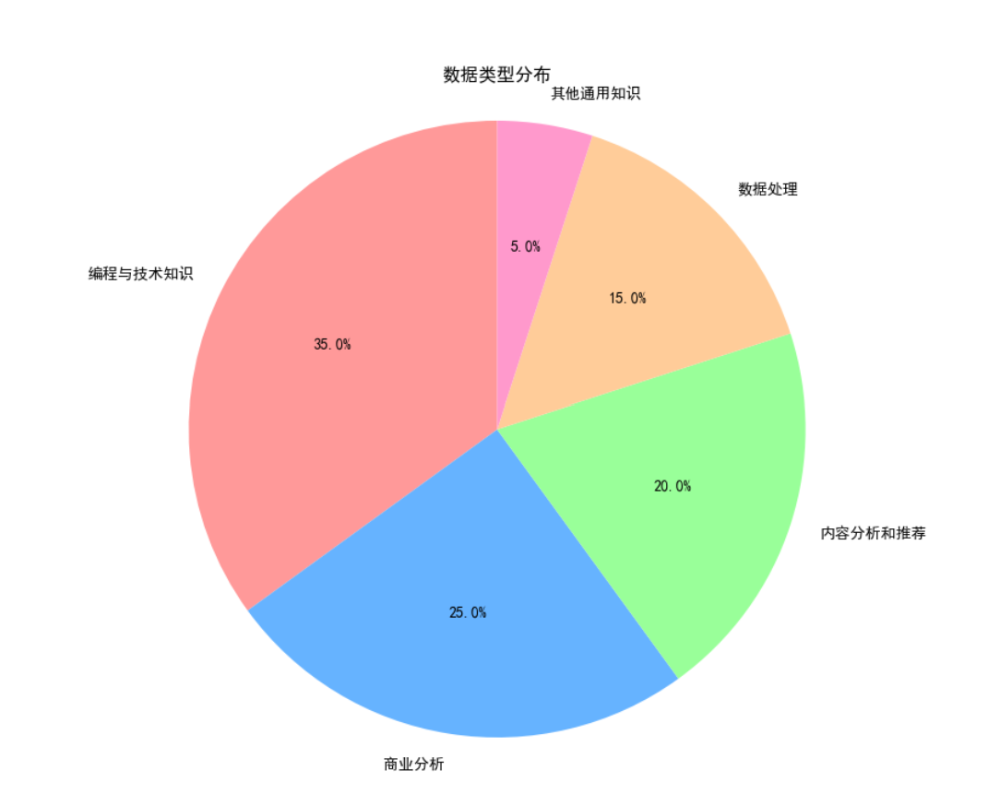<p>


### DPO数据
#### 创建偏好数据集
<details>
<summary>使用LM Studio本地部署 llama3-8b 生成偏好数据集</summary>
<pre><code>
输入
[
    {
        "instruction": "What is the state capital of California?",
        "input": "",
        "output": "The state capital of California is Sacramento.",
    },
    {
        "instruction": "Provide a synonym for 'fast'.",
        "input": "",
        "output": "A synonym for 'fast' is 'quick'.",
    },
...
]
输出
[
    {
        "instruction": "What is the state capital of California?",
        "input": "",
        "output": "The state capital of California is Sacramento.",
        "rejected": "Look, the state capital of California is obviously Sacramento.",
        "chosen": "The state capital of California is Sacramento."
    },
    {
        "instruction": "Provide a synonym for 'fast'.",
        "input": "",
        "output": "A synonym for 'fast' is 'quick'.",
        "chosen": "A suitable alternative to 'fast' would be 'quick'.",
        "rejected": "A synonym for 'fast' is 'quick'."
    },
...
]
</code></pre>
</details>

在`generate-pre-data.py`中实现，生成`polite`和`impolite`的回答

#### 原理
>[Tips for LLM Pretraining and Evaluating Reward Models](https://magazine.sebastianraschka.com/p/tips-for-llm-pretraining-and-evaluating-rms)
- DPO是一种简化的方法，直接优化奖励而无需额外训练奖励模型
- 使用静态的、预生成的偏好数据进行训练，不依赖于在线生成的数据

<p align="center">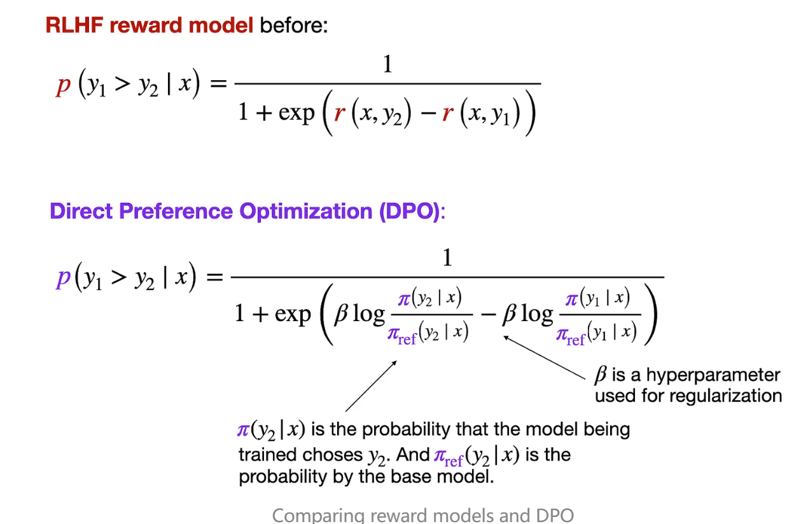<p>

  - “期望值” $\mathbb{E}$ 表示随机变量的平均值或均值；优化 $-\mathbb{E}$ 可以使模型更好地符合用户偏好
  - $\pi_{\theta}$ 变量是所谓的策略（这个术语源于强化学习），表示我们想要优化的LLM；$\pi_{ref}$ 是参考LLM，通常指优化前的原始LLM（在训练开始时，$\pi_{\theta}$ 和 $\pi_{ref}$ 通常是相同的）
  - $\beta$ 是一个超参数，用于控制 $\pi_{\theta}$ 和参考模型之间的差异；增加 $\beta$ 会增强 $\pi_{\theta}$ 和 $\pi_{ref}$ 在其对数概率方面对整体损失函数的影响，从而增加两个模型之间的差异
  - 逻辑 sigmoid 函数 $\sigma(\centerdot)$ 将首选和拒绝响应的对数几率（逻辑 sigmoid 函数内部的项）转换为概率分数

### 垃圾邮件分类
- 原始模型最后输出是将`隐藏层1024`维度投影回`50257维`(token词表大小,原始模型是预测下一个次输出的概率，从词表中选择概率最大的输出)
- 邮件分类为二分类任务，`0：ham`、`1：spam`，故训练模型时只需微调最后的输出层，使其从`1024维`投影到`2维`，模型其他层全部冻结
- 该项目中只做了二分类任务，若有多分类任务只需修改输出层输出维度即可

>[Finetuning Large Language Models](https://magazine.sebastianraschka.com/p/finetuning-large-language-models)

博客中实验表明微调额外层可以显着提高性能，训练时额外训练最后一个Transformer和LayerNorm

#### loss计算
根据因果掩码注意力原理，最后一个token输出是包含全局信息的，所以计算损失时取最后一个输出token计算

输入：`[batch, num_token, embedding(1024)]` ->(经过Transformer后)->`[batch, -1, embedding(1024)]`(取最后一个)->(LayerNorm和线性层输出)->`[batch, 1, 2(0和1的概率)]`


## 实验

### 指令微调
`data/instruction-data.json`

| A：learning_rate = 5e-5、weight_decay = 0.1、epochs = 2、batch=5   | B：learning_rate = 5e-6、weight_decay = 0.1、epochs = 2、batch=5   |
|----------------------------------------------------------------|----------------------------------------------------------------|
| <p align="center">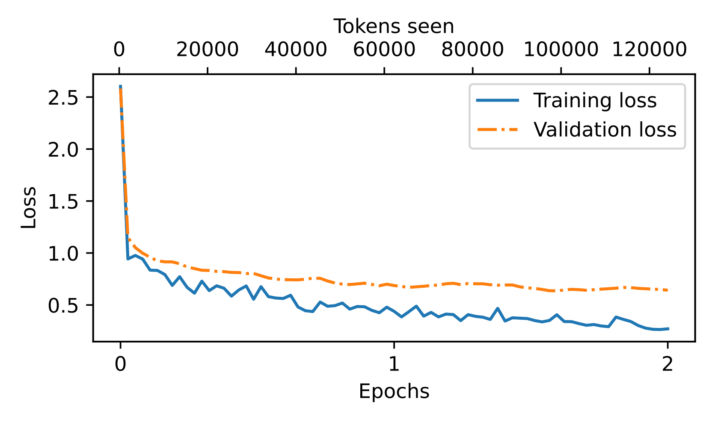<p> | <p align="center">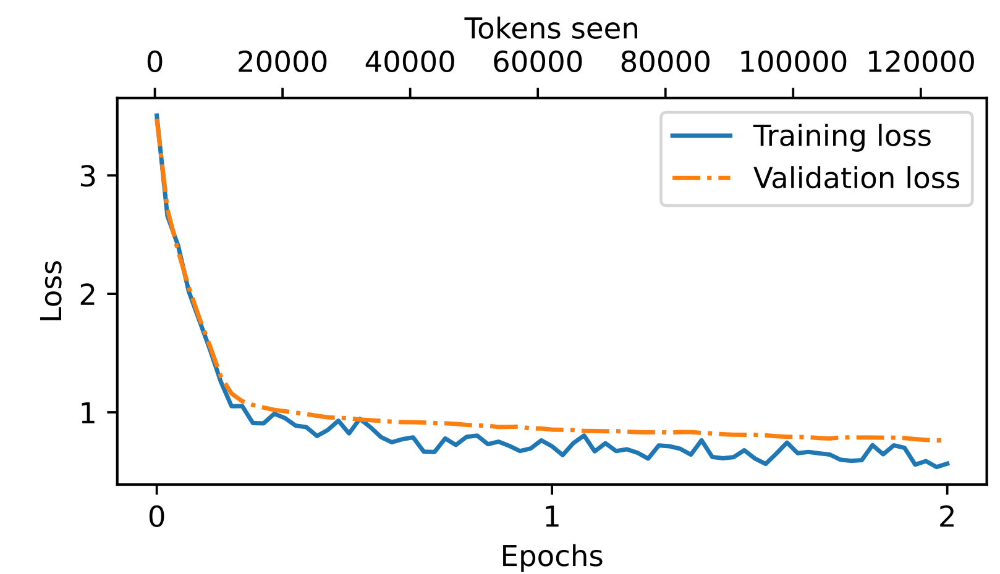<p> |
| C：learning_rate = 5e-5、weight_decay = 0.1、epochs = 2、batch=10  | D：learning_rate = 5e-5、weight_decay = 0.1、epochs = 2、batch=16  |
| <p align="center">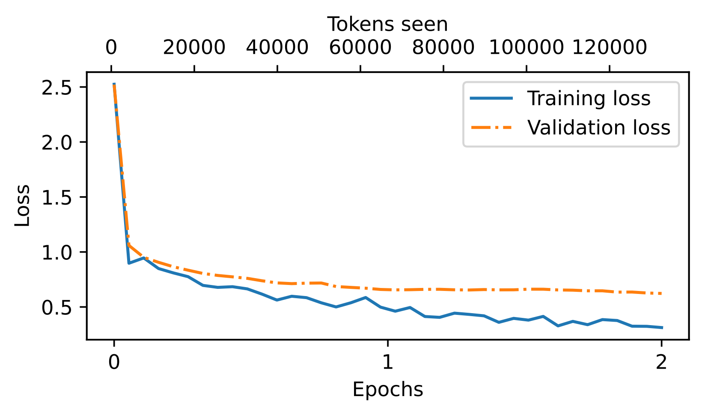<p> | <p align="center">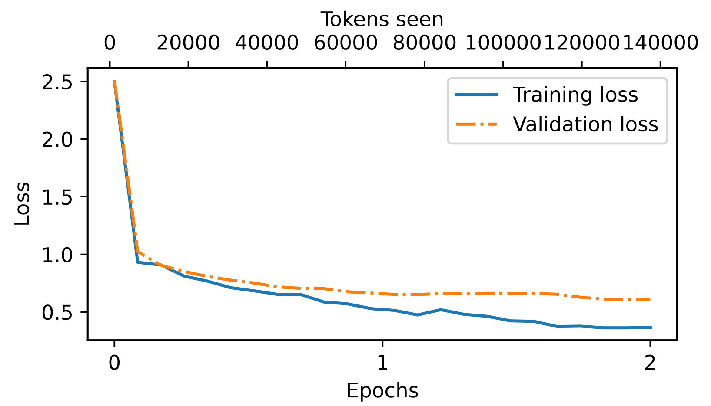<p> |

- 由于数据量较少，模型损失很快收敛，在大约1个epoch时出现了轻微的过度拟合
- 由A、B来看，当学习率调较小时，模型后面损失无法再下降
- 由A、C、D实验来看，相同参数下，`越大的batch_size会有更好的训练效果`。batch_size越大，训练样本都在同一空间下没有给分开，可以更好的学习到特征
- 计算loss时将instruct和input都算loss，这时需要改进的

#### 评估
评估`instruction-data.json`数据，运行`eval.py`

利用现有更大参数的模型进行评估，prompt如下
```
Given the input:{} and correct output:{}, 
on a scale from 0 to 100, where 100 is the best score. 
Respond with the integer number only.
```
最后取得分总平均值评估模型训练效果

使用LM Studio本地部署`meta-llama-3-8b`评估平均得分：`61.45`


#### 扩展实验
Llama2进行指令微调时是只对输出计算loss，这里也尝试只对`###response`输出计算loss
<p align="center">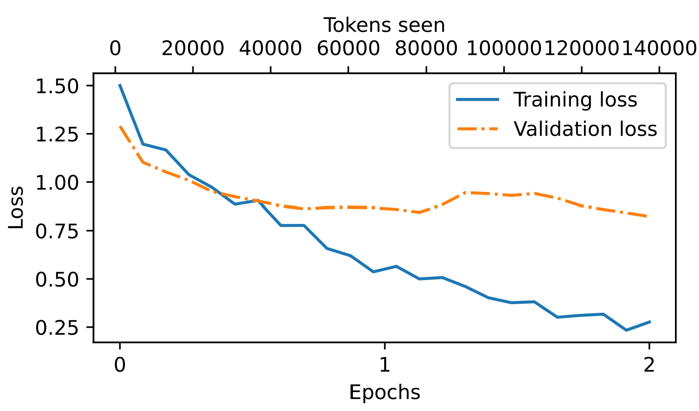<p>

训练效果不好。估计是GPT-2 模型并没有使用类似于 Llama2的`[INST]`、`[/INST]`特定标记来区assistant和user。

GPT2只有`BOS`，`EOS`，`<|endoftext|>`这些特殊token，若想训练良好的对话效果，需要额外添加特殊token

### 垃圾邮件分类
| | |
|-----------------------------------------------------------------------|------------------------------------------------------------------------|
| <p align="center">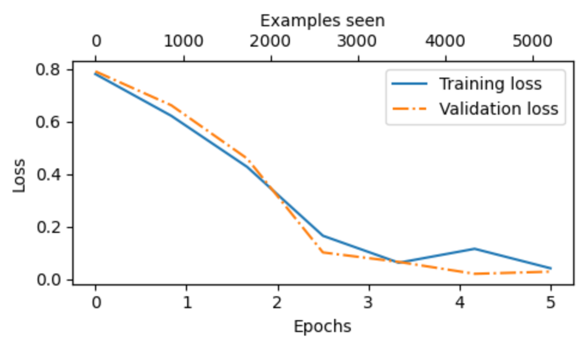<p>        | <p align="center">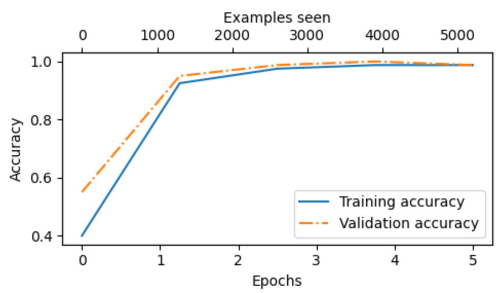<p>         |
- 使用GPT2-small(124M)、learning_rate = 5e-5、weight_decay = 0.1、epochs = 5、batch=8 
- Train acc: 98.27%
- Val acc: 97.99%
- Test acc: 96.33%

#### 扩展实验
- 相对于只训练最后一层线性层，额外训练最后的LN和Transformer分类效果会好很多（对GPT2-small和GPT2-medium同样适用）
- 较大的模型不一定有更好的训练效果，使用GPT2-medium（335M）训练时，无论如何设置学习率，loss在后面始终会震荡，猜测可能是训练数据量少的问题，实验结果如下图

| | |
|-----------------------------------------------------------------------|------------------------------------------------------------------------|
| <p align="center">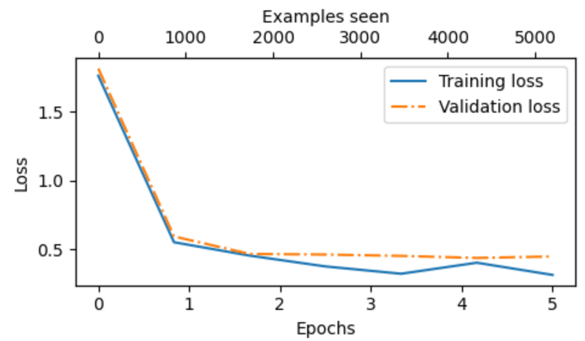<p>        | <p align="center">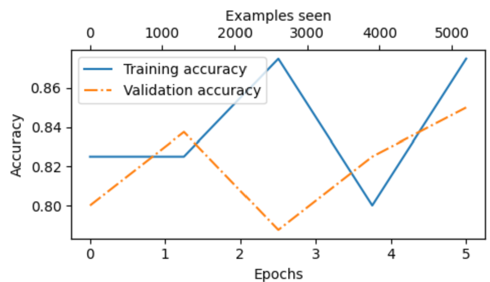<p>         |
loss虽然下降，但分类准确率却震荡

### DPO

| learning_rate = 5e-5、weight_decay = 0.1、epochs = 1、batch=4、beta = 0.2 | learning_rate = 5e-6、weight_decay = 0.01、epochs = 1、batch=4、beta = 0.1 |
|-----------------------------------------------------------------------|------------------------------------------------------------------------|
| <p align="center">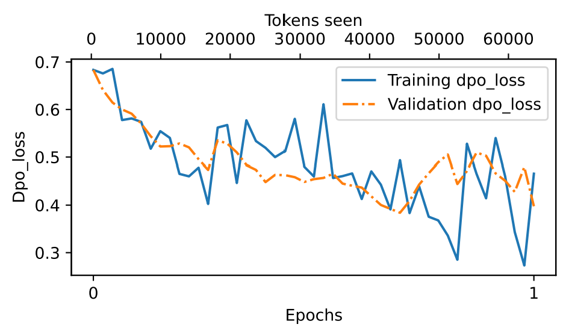<p>        | <p align="center">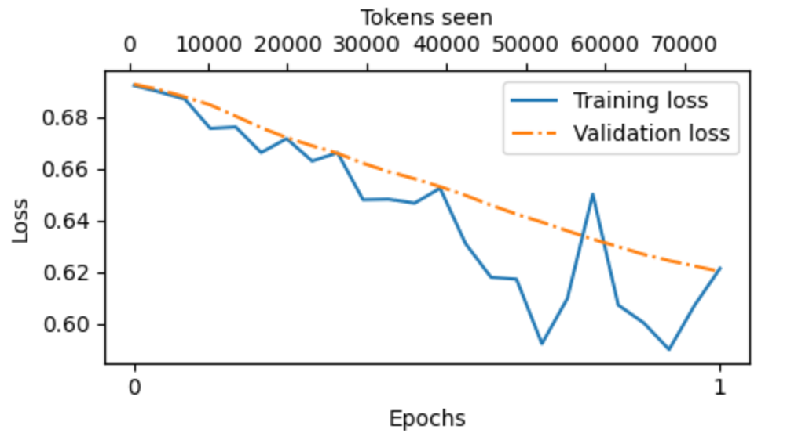<p>         |
| <p align="center">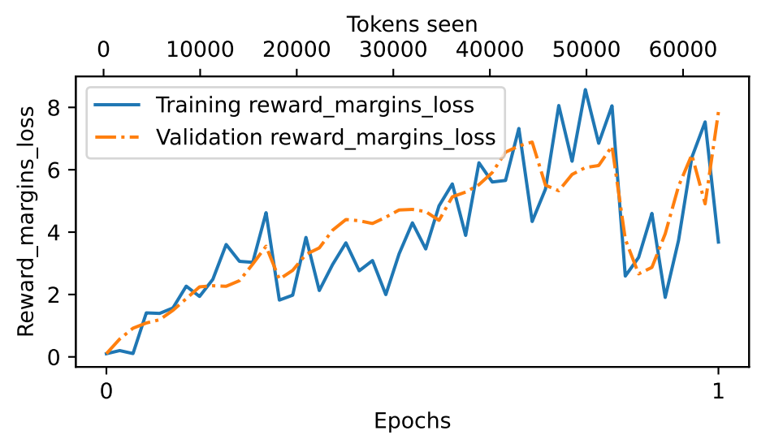<p>        | <p align="center">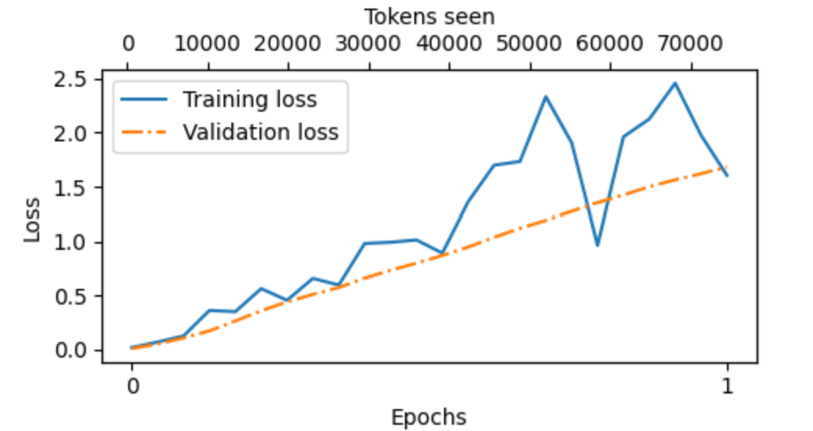<p>         |

- $\beta$通常在0.1到0.5之间，0时忽略参考模型，值越大，DPO影响越小
- DPO很容易崩溃，即使损失有所改善，生成文本的效果也可能不好，所以需要不断检查模型生成效果
- 学习率不能调太大

### 存在问题
- 由于模型较小，sft参数不多，当输入句子有句号和无句号会对结果有影响
- 在instruct计算损失时也计算了instruct和input，可能会影响结果
- DPO有待改进