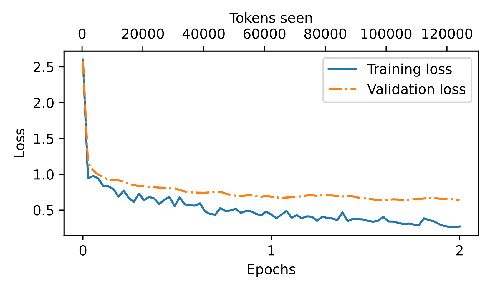
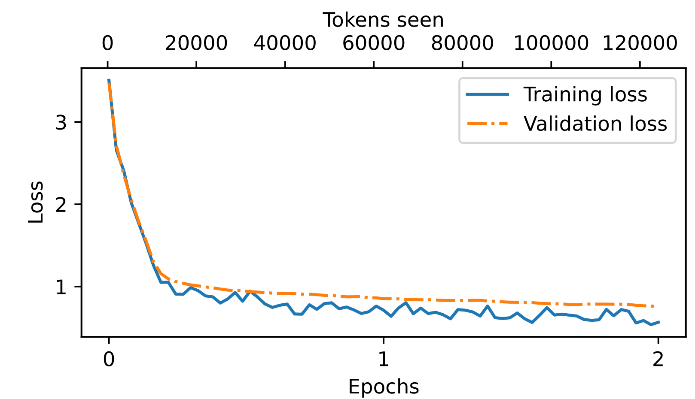

# GPT2-SFT


项目参考：

[GitHub - rasbt/LLMs-from-scratch: Implement a ChatGPT-like LLM in PyTorch from scratch, step by step](https://github.com/rasbt/LLMs-from-scratch)

在此书项目上搭建进行指令微调，数据集来源该书第七章，

Transformer构建：[GitHub - JY-Ou/build\_a\_transformer: 从零搭建原始Transformer](https://github.com/JY-Ou/build_a_transformer)

## 数据

指令微调格式有两种格式
- [the Alpaca](https://crfm.stanford.edu/2023/03/13/alpaca.html)
- [Phi-3](https://arxiv.org/abs/2404.14219)

使用`Alpaca`格式
```jsonl
{'instruction': 'Identify the correct spelling of the following word.', 'input': 'Ocassion', 'output': "The correct spelling is 'Occasion.'"}
{'instruction': "What is an antonym of 'complicated'?", 'input': '', 'output': "An antonym of 'complicated' is 'simple'."}
```

- 填充Padding使同一batch下的样本同一长度（但不同batch可以具有不同的长度）
- 使用 `<|endoftext|>` 为padding token，训练时使用`ignore_index`(-100)替换padding token，使其在训练时不计算padding损失
（文本末尾的`<|endoftext|>`不替换，告诉LLM这是句尾）
- 在训练时会屏蔽掉instruction的损失

Llama训练扩展：
- LLAMA2-chat中user标识 是 `[INST]` ， assistant 标识是`[/INST]`，模型只能接受非结构化数据，利用chat模版转换输入如：`[INST]`今天天气怎样`[/INST]`今天天气很好
- sft时input_ids对应模型输入，labels则是为了和模型输出计算loss，则只需在每轮对话头尾使用`[BOS]`和`[EOS]`
```jsonl
chat_temp = [
                {"role": "user", "content": Q1},
                {"role": "assistant", "content": A1},
                {"role": "user", "content": Q2},
                {"role": "assistant", "content": A2},
            ]

[BOS][INST]Q1[\INST]A1[EOS][BOS][INST]Q2[\INST]A2[EOS]
```
模型是由上一个输入预测下一个输出，则label为

| input | [BOS] | [INST] |Q| [/INST] |A| [EOS] | [BOS] | [INST] | Q2 | [/INST] |A2|
|-------|-------|--------|--|-------|--|-------|-------|--------|----|---------|--|
| label | -100  | -100   |-100| A     |[EOS]|       |       |        |    |          A2 |	[EOS]|

- 在sft阶段仅对response计算loss，目的是让response对prompt做出反应

## 实验
### 指令微调
btach_size:5

| learning_rate = 5e-5、weight_decay = 0.1、epochs = 2             | learning_rate = 5e-6、weight_decay = 0.1、epochs = 2                                                |
|----------------------------------------------------------------|---------------------------------------------------------------|
| <p align="center"><p> | <p align="center"><p> |

- 由于数据量较少，模型损失很快收敛，在大约1个epoch时出现了轻微的过度拟合
- 学习率降低可以减缓拟合现象


